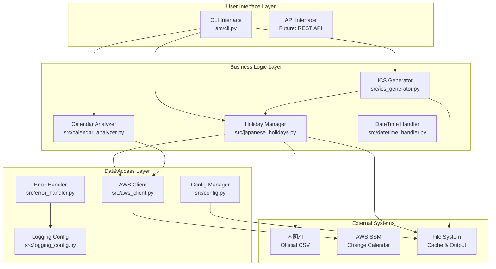

# 🏗️ 開発者向けアーキテクチャガイド

## 📋 概要

AWS SSM Change Calendar 休業日スケジュール管理ツールの内部アーキテクチャ、設計思想、拡張方法について詳しく説明します。

## 🎯 対象読者

- **システムアーキテクト**: 全体設計を理解したい方
- **開発者**: 内部実装を理解し、機能拡張したい方
- **コントリビューター**: プロジェクトに貢献したい方
- **技術リーダー**: 技術的な意思決定を行う方

---

## 🏛️ アーキテクチャ概要

### システム全体図



### 設計原則

#### 1. 単一責任原則 (SRP)
各クラスは単一の責任を持ちます：
- `JapaneseHolidays`: 祝日データ管理のみ
- `ICSGenerator`: ICS形式生成のみ
- `CalendarAnalyzer`: カレンダー解析のみ

#### 2. 依存性逆転原則 (DIP)
高レベルモジュールは低レベルモジュールに依存しません：
```python
# 良い例: インターフェースに依存
class ICSGenerator:
    def __init__(self, holiday_provider: HolidayProvider):
        self.holiday_provider = holiday_provider

# 悪い例: 具象クラスに依存
class ICSGenerator:
    def __init__(self):
        self.holidays = JapaneseHolidays()  # 直接依存
```

#### 3. オープン・クローズド原則 (OCP)
拡張に対して開いており、修正に対して閉じています：
```python
# 拡張可能な設計
class HolidayProvider(ABC):
    @abstractmethod
    def get_holidays(self, year: int) -> List[Holiday]:
        pass

class JapaneseHolidays(HolidayProvider):
    def get_holidays(self, year: int) -> List[Holiday]:
        # 日本の祝日実装
        pass

class USHolidays(HolidayProvider):  # 新しい国の祝日を追加
    def get_holidays(self, year: int) -> List[Holiday]:
        # アメリカの祝日実装
        pass
```

---

## 🧩 コンポーネント詳細

### 1. Holiday Manager (src/japanese_holidays.py)

#### 責任
- 内閣府公式データの取得・解析
- 祝日データのキャッシュ管理
- 高速な祝日判定機能

#### 主要クラス

```python
class JapaneseHolidays:
    """日本祝日管理のメインクラス"""
    
    def __init__(self, cache_file: Optional[str] = None, 
                 enable_monitoring: bool = True):
        self.cache_file = cache_file or self._get_default_cache_path()
        self.enable_monitoring = enable_monitoring
        self._holidays_dict: Dict[date, str] = {}
        self._stats = HolidayStats()
    
    def is_holiday(self, check_date: date) -> bool:
        """O(1)の高速祝日判定"""
        return check_date in self._holidays_dict
    
    def get_holidays_by_year(self, year: int) -> List[Tuple[date, str]]:
        """年単位での祝日取得"""
        return [(d, name) for d, name in self._holidays_dict.items() 
                if d.year == year]
```

#### データ構造

```python
@dataclass
class Holiday:
    date: date
    name: str
    category: str = "national"
    is_substitute: bool = False
    
class HolidayStats:
    total_count: int = 0
    min_year: int = 9999
    max_year: int = 0
    by_year: Dict[int, int] = field(default_factory=dict)
    by_category: Dict[str, int] = field(default_factory=dict)
```

#### パフォーマンス最適化

```python
class OptimizedHolidayLookup:
    """高速検索用の最適化されたデータ構造"""
    
    def __init__(self, holidays: List[Holiday]):
        # O(1)検索用のハッシュテーブル
        self._holiday_dict = {h.date: h for h in holidays}
        
        # 年別インデックス
        self._year_index = defaultdict(list)
        for holiday in holidays:
            self._year_index[holiday.date.year].append(holiday)
    
    def is_holiday(self, check_date: date) -> bool:
        return check_date in self._holiday_dict  # O(1)
    
    def get_year_holidays(self, year: int) -> List[Holiday]:
        return self._year_index[year]  # O(1) + O(k) where k = holidays in year
```

### 2. ICS Generator (src/ics_generator.py)

#### 責任
- AWS SSM Change Calendar準拠のICS生成
- RFC 5545 iCalendar標準への準拠
- UTF-8エンコーディング処理

#### アーキテクチャパターン

```python
class ICSGenerator:
    """Builder パターンを使用したICS生成"""
    
    def __init__(self, holiday_provider: HolidayProvider):
        self.holiday_provider = holiday_provider
        self.calendar = None
        self._events_converted = False
    
    def create_aws_ssm_calendar(self) -> Calendar:
        """AWS SSM専用カレンダー作成"""
        calendar = Calendar()
        
        # AWS SSM必須プロパティ
        calendar.add('prodid', '-//AWS//Change Calendar 1.0//EN')
        calendar.add('version', '2.0')
        calendar.add('x-calendar-type', 'DEFAULT_OPEN')
        calendar.add('x-wr-caldesc', '')
        calendar.add('x-calendar-cmevents', 'DISABLED')
        calendar.add('x-wr-timezone', 'Asia/Tokyo')
        
        return calendar
    
    def add_timezone_definition(self) -> None:
        """タイムゾーン定義の追加"""
        timezone = Timezone()
        timezone.add('tzid', 'Asia/Tokyo')
        
        standard = TimezoneStandard()
        standard.add('dtstart', datetime(1970, 1, 1))
        standard.add('tzoffsettfrom', timedelta(hours=9))
        standard.add('tzoffsetto', timedelta(hours=9))
        standard.add('tzname', 'JST')
        
        timezone.add_component(standard)
        self.calendar.add_component(timezone)
```

#### イベント生成戦略

```python
class EventGenerationStrategy(ABC):
    """Strategy パターンによるイベント生成"""
    
    @abstractmethod
    def generate_event(self, holiday: Holiday) -> Event:
        pass

class AWSChangeCalendarStrategy(EventGenerationStrategy):
    """AWS Change Calendar専用イベント生成"""
    
    def generate_event(self, holiday: Holiday) -> Event:
        event = Event()
        
        # AWS Change Calendar必須プロパティ
        event.add('uid', f'jp-holiday-{holiday.date.strftime("%Y%m%d")}@aws-ssm-change-calendar')
        event.add('dtstamp', datetime.now(tz=timezone.utc))
        event.add('dtstart', holiday.date)
        event.add('dtend', holiday.date + timedelta(days=1))
        event.add('summary', f'日本の祝日: {holiday.name}')
        event.add('description', f'日本の国民の祝日: {holiday.name}')
        event.add('categories', 'Japanese-Holiday')
        
        return event

class StandardICSStrategy(EventGenerationStrategy):
    """標準ICS形式イベント生成"""
    
    def generate_event(self, holiday: Holiday) -> Event:
        # 標準的なICSイベント生成
        pass
```

### 3. Calendar Analyzer (src/calendar_analyzer.py)

#### 責任
- ICSファイルの解析・検証
- カレンダー間の比較・差分検出
- AWS Change Calendarとの統合比較

#### 比較アルゴリズム

```python
class SemanticDiffEngine:
    """意味的差分検出エンジン"""
    
    def __init__(self):
        self.matchers = [
            UIDMatcher(),      # 主キー: UID
            DateSummaryMatcher(),  # 副キー: DTSTART + SUMMARY
            FuzzyMatcher()     # あいまい一致
        ]
    
    def detect_changes(self, events1: List[Event], 
                      events2: List[Event]) -> DiffResult:
        """多段階マッチングによる変更検出"""
        
        matched_pairs = []
        unmatched1 = events1.copy()
        unmatched2 = events2.copy()
        
        # 段階的マッチング
        for matcher in self.matchers:
            pairs, unmatched1, unmatched2 = matcher.match(
                unmatched1, unmatched2
            )
            matched_pairs.extend(pairs)
        
        return DiffResult(
            matched_pairs=matched_pairs,
            added=unmatched2,
            deleted=unmatched1
        )

class UIDMatcher(EventMatcher):
    """UID による完全一致"""
    
    def match(self, events1: List[Event], 
              events2: List[Event]) -> MatchResult:
        uid_map1 = {e.get('uid'): e for e in events1 if e.get('uid')}
        uid_map2 = {e.get('uid'): e for e in events2 if e.get('uid')}
        
        matched_pairs = []
        for uid in uid_map1:
            if uid in uid_map2:
                matched_pairs.append((uid_map1[uid], uid_map2[uid]))
        
        # マッチしなかったイベントを返す
        matched_uids = {pair[0].get('uid') for pair in matched_pairs}
        unmatched1 = [e for e in events1 if e.get('uid') not in matched_uids]
        unmatched2 = [e for e in events2 if e.get('uid') not in matched_uids]
        
        return MatchResult(matched_pairs, unmatched1, unmatched2)
```

### 4. AWS Client (src/aws_client.py)

#### 責任
- AWS SSM API との通信
- 認証・権限管理
- エラーハンドリング・リトライ

#### 設計パターン

```python
class SSMChangeCalendarClient:
    """Facade パターンによるAWS SSM操作の簡素化"""
    
    def __init__(self, region_name: str = 'ap-northeast-1',
                 profile_name: Optional[str] = None):
        self.session = self._create_session(profile_name)
        self.ssm_client = self.session.client('ssm', region_name=region_name)
        self.retry_config = RetryConfig()
    
    @retry_with_backoff
    def get_change_calendar(self, calendar_name: str) -> Dict:
        """Change Calendar取得（リトライ付き）"""
        try:
            response = self.ssm_client.get_document(Name=calendar_name)
            return response
        except ClientError as e:
            if e.response['Error']['Code'] == 'DocumentNotFound':
                raise CalendarNotFoundError(f"Calendar '{calendar_name}' not found")
            raise AWSError(f"Failed to get calendar: {e}")

class RetryConfig:
    """リトライ設定"""
    max_attempts: int = 3
    base_delay: float = 1.0
    max_delay: float = 60.0
    backoff_factor: float = 2.0

def retry_with_backoff(func):
    """指数バックオフ付きリトライデコレータ"""
    @wraps(func)
    def wrapper(self, *args, **kwargs):
        config = self.retry_config
        
        for attempt in range(config.max_attempts):
            try:
                return func(self, *args, **kwargs)
            except (ConnectionError, TimeoutError) as e:
                if attempt == config.max_attempts - 1:
                    raise
                
                delay = min(
                    config.base_delay * (config.backoff_factor ** attempt),
                    config.max_delay
                )
                time.sleep(delay)
        
    return wrapper
```

---

## 🔧 拡張ガイド

### 新しい祝日プロバイダーの追加

#### 1. インターフェースの実装

```python
class HolidayProvider(ABC):
    """祝日プロバイダーの基底クラス"""
    
    @abstractmethod
    def get_holidays(self, year: int) -> List[Holiday]:
        """指定年の祝日を取得"""
        pass
    
    @abstractmethod
    def is_holiday(self, check_date: date) -> bool:
        """祝日判定"""
        pass

class USHolidays(HolidayProvider):
    """アメリカの祝日プロバイダー"""
    
    def __init__(self):
        self.federal_holidays = {
            # アメリカの連邦祝日定義
        }
    
    def get_holidays(self, year: int) -> List[Holiday]:
        # アメリカの祝日計算ロジック
        holidays = []
        
        # New Year's Day
        holidays.append(Holiday(
            date=date(year, 1, 1),
            name="New Year's Day",
            category="federal"
        ))
        
        # Independence Day
        holidays.append(Holiday(
            date=date(year, 7, 4),
            name="Independence Day",
            category="federal"
        ))
        
        return holidays
    
    def is_holiday(self, check_date: date) -> bool:
        year_holidays = self.get_holidays(check_date.year)
        return check_date in [h.date for h in year_holidays]
```

#### 2. ファクトリーパターンでの統合

```python
class HolidayProviderFactory:
    """祝日プロバイダーのファクトリー"""
    
    _providers = {
        'japan': JapaneseHolidays,
        'us': USHolidays,
        'uk': UKHolidays,  # 将来の拡張
    }
    
    @classmethod
    def create(cls, country: str, **kwargs) -> HolidayProvider:
        if country not in cls._providers:
            raise ValueError(f"Unsupported country: {country}")
        
        return cls._providers[country](**kwargs)
    
    @classmethod
    def register(cls, country: str, provider_class: Type[HolidayProvider]):
        """新しいプロバイダーの登録"""
        cls._providers[country] = provider_class

# 使用例
holidays = HolidayProviderFactory.create('japan')
us_holidays = HolidayProviderFactory.create('us')
```

### カスタム出力形式の追加

#### 1. フォーマッターの実装

```python
class OutputFormatter(ABC):
    """出力フォーマッターの基底クラス"""
    
    @abstractmethod
    def format_holidays(self, holidays: List[Holiday]) -> str:
        pass

class XMLFormatter(OutputFormatter):
    """XML形式フォーマッター"""
    
    def format_holidays(self, holidays: List[Holiday]) -> str:
        root = ET.Element("holidays")
        
        for holiday in holidays:
            holiday_elem = ET.SubElement(root, "holiday")
            ET.SubElement(holiday_elem, "date").text = holiday.date.isoformat()
            ET.SubElement(holiday_elem, "name").text = holiday.name
            ET.SubElement(holiday_elem, "category").text = holiday.category
        
        return ET.tostring(root, encoding='unicode', xml_declaration=True)

class MarkdownFormatter(OutputFormatter):
    """Markdown形式フォーマッター"""
    
    def format_holidays(self, holidays: List[Holiday]) -> str:
        lines = ["# 祝日一覧", ""]
        
        for holiday in holidays:
            lines.append(f"## {holiday.date.strftime('%Y年%m月%d日')}")
            lines.append(f"**{holiday.name}**")
            lines.append(f"カテゴリ: {holiday.category}")
            lines.append("")
        
        return "\n".join(lines)
```

#### 2. フォーマッターレジストリ

```python
class FormatterRegistry:
    """フォーマッターの登録・管理"""
    
    _formatters: Dict[str, Type[OutputFormatter]] = {
        'json': JSONFormatter,
        'csv': CSVFormatter,
        'xml': XMLFormatter,
        'markdown': MarkdownFormatter,
    }
    
    @classmethod
    def get_formatter(cls, format_name: str) -> OutputFormatter:
        if format_name not in cls._formatters:
            raise ValueError(f"Unknown format: {format_name}")
        
        return cls._formatters[format_name]()
    
    @classmethod
    def register(cls, format_name: str, formatter_class: Type[OutputFormatter]):
        cls._formatters[format_name] = formatter_class
    
    @classmethod
    def list_formats(cls) -> List[str]:
        return list(cls._formatters.keys())
```

---

## 🧪 テスト戦略

### テストピラミッド

```
    /\
   /  \     E2E Tests (少数)
  /____\    - 実際のAWS環境でのテスト
 /      \   - CLI統合テスト
/________\  
           Integration Tests (中程度)
          - モジュール間の統合テスト
          - モックAWS環境でのテスト
         ________________________
        Unit Tests (多数)
       - 各クラス・メソッドの単体テスト
       - 高速・独立・決定的
```

### 単体テストの例

```python
class TestJapaneseHolidays(unittest.TestCase):
    """JapaneseHolidays クラスの単体テスト"""
    
    def setUp(self):
        # テスト用の一時キャッシュファイル
        self.temp_cache = tempfile.NamedTemporaryFile(delete=False)
        self.holidays = JapaneseHolidays(
            cache_file=self.temp_cache.name,
            enable_monitoring=False
        )
    
    def tearDown(self):
        os.unlink(self.temp_cache.name)
    
    def test_is_holiday_new_year(self):
        """元日の祝日判定テスト"""
        self.assertTrue(self.holidays.is_holiday(date(2024, 1, 1)))
    
    def test_is_not_holiday_regular_day(self):
        """平日の祝日判定テスト"""
        self.assertFalse(self.holidays.is_holiday(date(2024, 1, 2)))
    
    @patch('src.japanese_holidays.requests.get')
    def test_fetch_official_data_success(self, mock_get):
        """祝日データ取得成功テスト"""
        mock_response = Mock()
        mock_response.text = "2024-01-01,元日\n2024-01-08,成人の日"
        mock_response.raise_for_status.return_value = None
        mock_get.return_value = mock_response
        
        data = self.holidays.fetch_official_data()
        self.assertIn("元日", data)
        self.assertIn("成人の日", data)
    
    @patch('src.japanese_holidays.requests.get')
    def test_fetch_official_data_network_error(self, mock_get):
        """ネットワークエラーテスト"""
        mock_get.side_effect = requests.ConnectionError("Network error")
        
        with self.assertRaises(NetworkError):
            self.holidays.fetch_official_data()
```

### 統合テストの例

```python
class TestICSGenerationIntegration(unittest.TestCase):
    """ICS生成の統合テスト"""
    
    def setUp(self):
        self.holidays = JapaneseHolidays(enable_monitoring=False)
        self.generator = ICSGenerator(self.holidays)
    
    def test_end_to_end_ics_generation(self):
        """エンドツーエンドICS生成テスト"""
        # 祝日データ取得
        year_holidays = self.holidays.get_holidays_by_year(2024)
        self.assertGreater(len(year_holidays), 0)
        
        # ICS生成
        calendar = self.generator.create_aws_ssm_calendar()
        events = self.generator.convert_holidays_to_events(year_holidays)
        
        for event in events:
            calendar.add_component(event)
        
        # ICS内容検証
        ics_content = calendar.to_ical().decode('utf-8')
        
        self.assertIn('BEGIN:VCALENDAR', ics_content)
        self.assertIn('PRODID:-//AWS//Change Calendar 1.0//EN', ics_content)
        self.assertIn('元日', ics_content)
        self.assertIn('END:VCALENDAR', ics_content)
    
    def test_aws_ssm_compatibility(self):
        """AWS SSM互換性テスト"""
        calendar = self.generator.create_aws_ssm_calendar()
        
        # AWS SSM必須プロパティの確認
        self.assertEqual(
            calendar.get('prodid').to_ical().decode(),
            '-//AWS//Change Calendar 1.0//EN'
        )
        self.assertEqual(
            calendar.get('x-calendar-type').to_ical().decode(),
            'DEFAULT_OPEN'
        )
```

---

## 🔍 デバッグとプロファイリング

### ログ設定

```python
import logging
from src.logging_config import setup_logging

# 開発環境用ログ設定
setup_logging(
    level=logging.DEBUG,
    format='detailed',
    enable_performance_monitoring=True
)

# 本番環境用ログ設定
setup_logging(
    level=logging.WARNING,
    format='json',
    file_path='/var/log/holiday-calendar/app.log'
)
```

### パフォーマンス監視

```python
from src.performance_monitor import PerformanceMonitor

class JapaneseHolidays:
    def __init__(self, enable_monitoring: bool = True):
        self.monitor = PerformanceMonitor() if enable_monitoring else None
    
    @performance_monitor
    def is_holiday(self, check_date: date) -> bool:
        # 祝日判定ロジック
        return check_date in self._holidays_dict
    
    def get_performance_stats(self) -> Dict:
        """パフォーマンス統計取得"""
        if self.monitor:
            return self.monitor.get_stats()
        return {}

# 使用例
holidays = JapaneseHolidays(enable_monitoring=True)

# 大量の祝日判定
for i in range(10000):
    holidays.is_holiday(date(2024, 1, 1))

# パフォーマンス統計確認
stats = holidays.get_performance_stats()
print(f"Average response time: {stats['avg_response_time']:.3f}ms")
print(f"Total calls: {stats['total_calls']}")
```

### メモリプロファイリング

```python
import tracemalloc
from memory_profiler import profile

@profile
def memory_intensive_operation():
    """メモリ使用量の多い操作"""
    holidays = JapaneseHolidays()
    
    # 大量の年度データを処理
    all_holidays = []
    for year in range(2000, 2030):
        year_holidays = holidays.get_holidays_by_year(year)
        all_holidays.extend(year_holidays)
    
    return all_holidays

# メモリ使用量追跡
tracemalloc.start()

result = memory_intensive_operation()

current, peak = tracemalloc.get_traced_memory()
print(f"Current memory usage: {current / 1024 / 1024:.2f} MB")
print(f"Peak memory usage: {peak / 1024 / 1024:.2f} MB")

tracemalloc.stop()
```

---

## 🚀 デプロイメント戦略

### パッケージング

```python
# setup.py
from setuptools import setup, find_packages

setup(
    name="aws-ssm-calendar-generator",
    version="1.0.0",
    packages=find_packages(),
    install_requires=[
        "boto3>=1.26.0",
        "icalendar>=5.0.0",
        "click>=8.0.0",
        "requests>=2.28.0",
        "chardet>=5.0.0",
        "pytz>=2022.1",
        "python-dateutil>=2.8.0",
    ],
    extras_require={
        "dev": [
            "pytest>=7.0.0",
            "pytest-cov>=4.0.0",
            "black>=22.0.0",
            "flake8>=5.0.0",
            "mypy>=0.991",
        ],
        "monitoring": [
            "memory-profiler>=0.60.0",
            "psutil>=5.9.0",
        ]
    },
    entry_points={
        "console_scripts": [
            "holiday-calendar=src.cli:cli",
        ],
    },
    python_requires=">=3.8",
)
```

### Docker化

```dockerfile
# Dockerfile
FROM python:3.11-slim

WORKDIR /app

# システム依存関係
RUN apt-get update && apt-get install -y \
    curl \
    && rm -rf /var/lib/apt/lists/*

# Python依存関係
COPY requirements.txt .
RUN pip install --no-cache-dir -r requirements.txt

# アプリケーションコード
COPY src/ ./src/
COPY main.py .

# 非rootユーザーで実行
RUN useradd -m -u 1000 appuser && chown -R appuser:appuser /app
USER appuser

# ヘルスチェック
HEALTHCHECK --interval=30s --timeout=10s --start-period=5s --retries=3 \
    CMD python main.py --help || exit 1

ENTRYPOINT ["python", "main.py"]
```

### CI/CD パイプライン

```yaml
# .github/workflows/ci.yml
name: CI/CD Pipeline

on:
  push:
    branches: [ main, develop ]
  pull_request:
    branches: [ main ]

jobs:
  test:
    runs-on: ubuntu-latest
    strategy:
      matrix:
        python-version: [3.8, 3.9, "3.10", "3.11"]
    
    steps:
    - uses: actions/checkout@v3
    
    - name: Set up Python ${{ matrix.python-version }}
      uses: actions/setup-python@v4
      with:
        python-version: ${{ matrix.python-version }}
    
    - name: Install dependencies
      run: |
        python -m pip install --upgrade pip
        pip install -r requirements.txt
        pip install -r requirements-dev.txt
    
    - name: Lint with flake8
      run: |
        flake8 src/ --count --select=E9,F63,F7,F82 --show-source --statistics
        flake8 src/ --count --exit-zero --max-complexity=10 --max-line-length=127 --statistics
    
    - name: Type check with mypy
      run: mypy src/
    
    - name: Test with pytest
      run: |
        pytest tests/ --cov=src --cov-report=xml
    
    - name: Upload coverage to Codecov
      uses: codecov/codecov-action@v3
      with:
        file: ./coverage.xml

  security:
    runs-on: ubuntu-latest
    steps:
    - uses: actions/checkout@v3
    - name: Run security scan
      run: |
        pip install bandit safety
        bandit -r src/
        safety check
```

このアーキテクチャガイドにより、開発者はシステムの内部構造を理解し、効果的に機能拡張や保守を行うことができます。