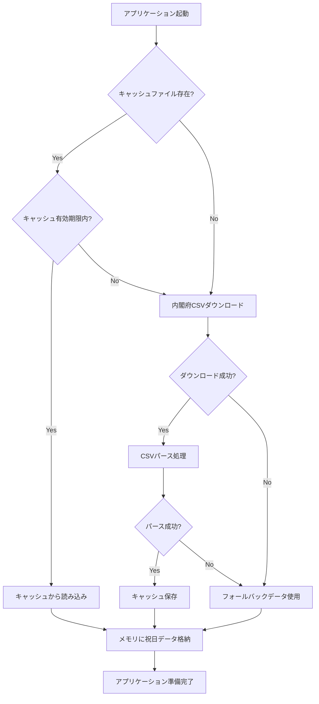
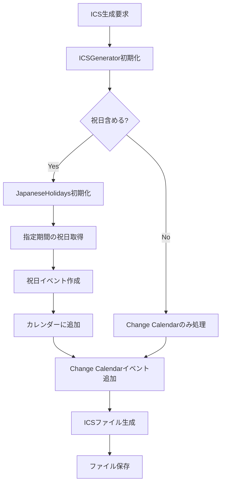

# 技術仕様書 - 日本の祝日取得機能

## 1. システム構成図

```
┌─────────────────────────────────────────────────────────────┐
│                    AWS SSM Change Calendar ICS Generator    │
├─────────────────────────────────────────────────────────────┤
│  CLI Interface (src/cli.py)                                 │
│  ├── holidays command                                       │
│  ├── check-holiday command                                  │
│  ├── refresh-holidays command                               │
│  └── export command (--include-holidays)                    │
├─────────────────────────────────────────────────────────────┤
│  ICS Generator (src/ics_generator.py)                       │
│  ├── add_japanese_holidays()                                │
│  ├── add_japanese_holidays_for_year()                       │
│  └── ICS file generation                                    │
├─────────────────────────────────────────────────────────────┤
│  Japanese Holidays Manager (src/japanese_holidays.py)       │
│  ├── Data download & cache                                  │
│  ├── Holiday search & validation                            │
│  └── Statistics & management                                │
└─────────────────────────────────────────────────────────────┘
                              │
                              ▼
┌─────────────────────────────────────────────────────────────┐
│                    External Dependencies                    │
├─────────────────────────────────────────────────────────────┤
│  Cabinet Office CSV                                         │
│  https://www8.cao.go.go.jp/chosei/shukujitsu/syukujitsu.csv│
├─────────────────────────────────────────────────────────────┤
│  Local Cache                                                │
│  ~/.aws-ssm-calendar/cache/japanese_holidays.csv           │
└─────────────────────────────────────────────────────────────┘
```

## 2. データフロー

### 2.1 祝日データ取得フロー



### 2.2 ICS生成フロー



## 3. クラス設計詳細

### 3.1 JapaneseHolidays クラス

```python
class JapaneseHolidays:
    """日本の祝日管理クラス"""
    
    # クラス定数
    CABINET_OFFICE_URL: str = "https://www8.cao.go.jp/chosei/shukujitsu/syukujitsu.csv"
    CACHE_VALIDITY_DAYS: int = 30
    
    # インスタンス変数
    cache_file: str                    # キャッシュファイルパス
    holidays: Dict[date, str]          # 祝日データ {日付: 祝日名}
    
    # 公開メソッド
    def __init__(self, cache_file: Optional[str] = None) -> None
    def is_holiday(self, check_date: date) -> bool
    def get_holiday_name(self, check_date: date) -> Optional[str]
    def get_holidays_in_range(self, start_date: date, end_date: date) -> List[Tuple[date, str]]
    def get_holidays_by_year(self, year: int) -> List[Tuple[date, str]]
    def get_next_holiday(self, from_date: Optional[date] = None) -> Optional[Tuple[date, str]]
    def refresh_data(self) -> None
    def get_stats(self) -> Dict[str, int]
    
    # プライベートメソッド
    def _get_default_cache_path(self) -> str
    def _load_holidays(self) -> None
    def _load_from_cache(self) -> None
    def _download_and_cache(self) -> None
    def _save_to_cache(self) -> None
    def _use_fallback_data(self) -> None
```

### 3.2 ICSGenerator 拡張

```python
class ICSGenerator:
    """ICSファイル生成クラス（祝日対応拡張）"""
    
    # 新規追加プロパティ
    include_japanese_holidays: bool
    japanese_holidays: Optional[JapaneseHolidays]
    
    # 新規追加メソッド
    def add_japanese_holidays(self, start_date: date, end_date: date) -> None
    def add_japanese_holidays_for_year(self, year: int) -> None
```

## 4. データ構造仕様

### 4.1 祝日データ構造

```python
# メモリ内データ構造
holidays: Dict[date, str] = {
    date(2024, 1, 1): "元日",
    date(2024, 1, 8): "成人の日",
    date(2024, 2, 11): "建国記念の日",
    # ...
}

# 統計情報構造
stats: Dict[str, int] = {
    "total": 1050,      # 総祝日数
    "years": 72,        # 対象年数
    "min_year": 1955,   # 最古年
    "max_year": 2026    # 最新年
}
```

### 4.2 CSVファイル構造

```csv
国民の祝日・休日月日,国民の祝日・休日名称
1955/1/1,元日
1955/1/15,成人の日
1955/3/21,春分の日
...
```

### 4.3 ICSイベント構造

```
BEGIN:VEVENT
SUMMARY:🎌 {祝日名}
DTSTART;VALUE=DATE:{YYYYMMDD}
DTEND;VALUE=DATE:{YYYYMMDD+1}
DTSTAMP:{現在時刻UTC}
UID:{日付}-japanese-holiday@aws-ssm-change-calendar
CATEGORIES:Japanese-Holiday
DESCRIPTION:日本の祝日: {祝日名}
END:VEVENT
```

## 5. ファイルシステム構造

```
プロジェクトルート/
├── src/
│   ├── japanese_holidays.py      # 祝日管理メインモジュール
│   ├── ics_generator.py          # ICS生成（祝日統合機能付き）
│   └── cli.py                    # CLI（祝日コマンド追加）
├── docs/
│   ├── japanese_holidays_specification.md
│   └── technical_specification.md
├── test_holidays.py              # 祝日機能テストスクリプト
├── debug_holidays.py             # デバッグ用スクリプト
└── quick_test.py                 # 簡易テストスクリプト

ユーザーホーム/
└── .aws-ssm-calendar/
    └── cache/
        └── japanese_holidays.csv  # 祝日データキャッシュ
```

## 6. API仕様

### 6.1 JapaneseHolidays API

#### 6.1.1 初期化
```python
# デフォルトキャッシュパス使用
holidays = JapaneseHolidays()

# カスタムキャッシュパス指定
holidays = JapaneseHolidays(cache_file="/path/to/cache.csv")
```

#### 6.1.2 祝日判定
```python
from datetime import date

# 特定日が祝日かチェック
is_holiday = holidays.is_holiday(date(2024, 1, 1))  # True

# 祝日名取得
name = holidays.get_holiday_name(date(2024, 1, 1))  # "元日"
```

#### 6.1.3 祝日検索
```python
# 期間指定検索
range_holidays = holidays.get_holidays_in_range(
    date(2024, 1, 1), 
    date(2024, 12, 31)
)

# 年指定検索
year_holidays = holidays.get_holidays_by_year(2024)

# 次の祝日検索
next_holiday = holidays.get_next_holiday()  # (date, name) or None
```

#### 6.1.4 データ管理
```python
# 強制更新
holidays.refresh_data()

# 統計情報取得
stats = holidays.get_stats()
print(f"Total holidays: {stats['total']}")
```

### 6.2 ICSGenerator API

#### 6.2.1 祝日統合初期化
```python
# 祝日機能有効化
generator = ICSGenerator(include_japanese_holidays=True)

# 祝日機能無効化（デフォルト）
generator = ICSGenerator(include_japanese_holidays=False)
```

#### 6.2.2 祝日追加
```python
from datetime import date

# 期間指定で祝日追加
generator.add_japanese_holidays(
    date(2024, 1, 1), 
    date(2024, 12, 31)
)

# 年指定で祝日追加
generator.add_japanese_holidays_for_year(2024)
```

## 7. エラーコード仕様

### 7.1 HTTP エラー
- `requests.exceptions.Timeout`: ダウンロードタイムアウト
- `requests.exceptions.ConnectionError`: ネットワーク接続エラー
- `requests.exceptions.HTTPError`: HTTPステータスエラー

### 7.2 ファイル I/O エラー
- `FileNotFoundError`: キャッシュファイル未存在
- `PermissionError`: ファイルアクセス権限エラー
- `OSError`: ディスク容量不足等

### 7.3 データ処理エラー
- `UnicodeDecodeError`: 文字エンコーディングエラー
- `csv.Error`: CSV解析エラー
- `ValueError`: 日付フォーマットエラー
- `json.JSONDecodeError`: JSON解析エラー

## 8. ログ仕様

### 8.1 ログレベル
- `INFO`: 正常処理（ダウンロード完了、キャッシュ読み込み等）
- `WARNING`: 警告（キャッシュ保存失敗等）
- `ERROR`: エラー（ダウンロード失敗、フォールバック使用等）

### 8.2 ログ出力例
```
INFO: Downloaded 1050 holidays
WARNING: Failed to save config file ~/.aws-ssm-calendar/config.json: Permission denied
ERROR: Failed to download holidays: Connection timeout
INFO: Using fallback data with 9 holidays
```

## 9. テスト仕様

### 9.1 単体テスト対象
- 祝日判定ロジック
- 日付範囲検索
- キャッシュ機能
- エラーハンドリング

### 9.2 統合テスト対象
- 内閣府CSV取得
- ICS生成統合
- CLI コマンド実行

### 9.3 テストデータ
```python
TEST_HOLIDAYS = {
    date(2024, 1, 1): "元日",
    date(2024, 1, 8): "成人の日",
    date(2024, 2, 11): "建国記念の日",
    date(2024, 2, 12): "休日",
    date(2024, 2, 23): "天皇誕生日"
}
```

## 10. パフォーマンス指標

### 10.1 レスポンス時間目標
- 祝日判定: < 1ms
- 年間祝日取得: < 10ms
- ICS生成（年間）: < 50ms
- 初回ダウンロード: < 3秒

### 10.2 メモリ使用量目標
- 祝日データ: < 100KB
- 処理時一時メモリ: < 1MB

### 10.3 ディスク使用量
- キャッシュファイル: < 50KB
- 年間ICSファイル: < 10KB

## 11. セキュリティ考慮事項

### 11.1 データ検証
- URL検証（内閣府ドメイン確認）
- SSL証明書検証
- ファイルサイズ制限
- 日付フォーマット検証

### 11.2 ファイルアクセス制御
- キャッシュディレクトリ権限制限
- パストラバーサル対策
- 一時ファイル安全削除

### 11.3 ネットワークセキュリティ
- HTTPS通信強制
- タイムアウト設定
- リダイレクト制限